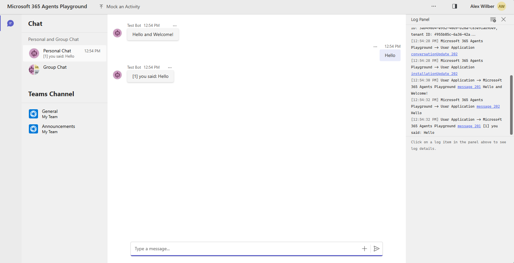

# Overview of the Basic Bot template

Examples of Microsoft Teams bots in everyday use include:

- Bots that notify about build failures.
- Bots that provide information about the weather or bus schedules.
- Bots that provide travel information.

A bot interaction can be a quick question and answer, or it can be a complex conversation. Being a cloud application, a bot can provide valuable and secure access to cloud services and corporate resources. 
This app template is built on top of [Microsoft Teams SDK](https://aka.ms/teams-ai-library-v2).
## Get started with the Basic Bot template

> **Prerequisites**
>
> To run the Basic Bot template in your local dev machine, you will need:
>
> - [Node.js](https://nodejs.org/), supported versions: 20, 22
> - [Microsoft 365 Agents Toolkit Visual Studio Code Extension](https://aka.ms/teams-toolkit) version 5.0.0 and higher or [Microsoft 365 Agents Toolkit CLI](https://aka.ms/teamsfx-toolkit-cli)

> For local debugging using Microsoft 365 Agents Toolkit CLI, you need to do some extra steps described in [Set up your Microsoft 365 Agents Toolkit CLI for local debugging](https://aka.ms/teamsfx-cli-debugging).

1. First, select the Microsoft 365 Agents Toolkit icon on the left in the VS Code toolbar.
2. Press F5 to start debugging which launches your app in Microsoft 365 Agents Playground using a web browser. Select `Debug in Microsoft 365 Agents Playground`.
3. The browser will pop up to open Microsoft 365 Agents Playground.
4. You will receive a welcome message from the bot, and you can send anything to the bot to get an echoed response.

**Congratulations**! You are running an application that can now interact with users in Microsoft 365 Agents Playground:




## What's included in the template

| Folder       | Contents                                            |
| - | - |
| `.vscode`    | VSCode files for debugging                          |
| `appPackage` | Templates for the application manifest        |
| `env`        | Environment files                                   |
| `infra`      | Templates for provisioning Azure resources          |

The following files can be customized and demonstrate an example implementation to get you started.

| File                                 | Contents                                           |
| - | - |
|`app.ts`| Handles business logics for the echo bot.|
|`index.ts`|`index.ts` is used to setup and configure the echo bot.|

The following are Microsoft 365 Agents Toolkit specific project files. You can [visit a complete guide on Github](https://github.com/OfficeDev/TeamsFx/wiki/Teams-Toolkit-Visual-Studio-Code-v5-Guide#overview) to understand how Microsoft 365 Agents Toolkit works.

| File                                 | Contents                                           |
| - | - |
|`m365agents.yml`|This is the main Microsoft 365 Agents Toolkit project file. The project file defines two primary things:  Properties and configuration Stage definitions. |
|`m365agents.local.yml`|This overrides `m365agents.yml` with actions that enable local execution and debugging.|
|`m365agents.playground.yml`| This overrides `m365agents.yml` with actions that enable local execution and debugging in Microsoft 365 Agents Playground.|

## Extend the Basic Bot template

Following documentation will help you to extend the Basic Bot template.

- [Add or manage the environment](https://learn.microsoft.com/microsoftteams/platform/toolkit/teamsfx-multi-env)
- [Create multi-capability app](https://learn.microsoft.com/microsoftteams/platform/toolkit/add-capability)
- [Add single sign on to your app](https://learn.microsoft.com/microsoftteams/platform/toolkit/add-single-sign-on)
- [Access data in Microsoft Graph](https://learn.microsoft.com/microsoftteams/platform/toolkit/teamsfx-sdk#microsoft-graph-scenarios)
- [Use an existing Microsoft Entra application](https://learn.microsoft.com/microsoftteams/platform/toolkit/use-existing-aad-app)
- [Customize the app manifest](https://learn.microsoft.com/microsoftteams/platform/toolkit/teamsfx-preview-and-customize-app-manifest)
- Host your app in Azure by [provision cloud resources](https://learn.microsoft.com/microsoftteams/platform/toolkit/provision) and [deploy the code to cloud](https://learn.microsoft.com/microsoftteams/platform/toolkit/deploy)
- [Collaborate on app development](https://learn.microsoft.com/microsoftteams/platform/toolkit/teamsfx-collaboration)
- [Set up the CI/CD pipeline](https://learn.microsoft.com/microsoftteams/platform/toolkit/use-cicd-template)
- [Publish the app to your organization or the Microsoft app store](https://learn.microsoft.com/microsoftteams/platform/toolkit/publish)
- [Develop with Microsoft 365 Agents Toolkit CLI](https://aka.ms/teams-toolkit-cli/debug)
- [Preview the app on mobile clients](https://aka.ms/teamsfx-mobile)

---

## ODIN Bot — Lokaler Testablauf

### Voraussetzungen

- Node.js ≥ 18
- `.env` Datei vorhanden (siehe `.env.example`)
- Microsoft 365 Agents Playground oder Teams Dev Portal Tunnel

### 1. Bot starten

```powershell
cd teams-bot/odin
npm run dev
# → Bot läuft auf http://localhost:3981
```

### 2. Nachricht im Playground senden

Öffne den **Microsoft 365 Agents Playground** (oder Teams mit Dev-Tunnel) und sende **"hi"** an den Bot.

In der Konsole erscheinen zwei Debug-Blöcke:

- `[DEBUG:INCOMING]` — zeigt `fromId`, `fromName`, `fromAadObjectId`, `conversationType`, `tenantId`
- `[DEBUG:CONVREF]` — zeigt den gespeicherten ConversationReference-Key und Scope

### 3. Debug-Endpunkte aufrufen

Alle Endpunkte erfordern den Header `x-bot-internal-api-key`.

**Health-Check:**

```powershell
Invoke-RestMethod -Uri "http://localhost:3981/api/internal/health" `
  -Headers @{ "x-bot-internal-api-key" = "odin-super-secret-key" }
```

**Conversation References anzeigen:**

```powershell
Invoke-RestMethod -Uri "http://localhost:3981/api/internal/debug/conversation-references" `
  -Headers @{ "x-bot-internal-api-key" = "odin-super-secret-key" } | ConvertTo-Json -Depth 5
```

**User Mappings anzeigen:**

```powershell
Invoke-RestMethod -Uri "http://localhost:3981/api/internal/debug/user-mappings" `
  -Headers @{ "x-bot-internal-api-key" = "odin-super-secret-key" } | ConvertTo-Json -Depth 5
```

### 4. Auto-Link prüfen

Wenn `DEBUG_FALLBACK_EMPLOYEE_ID=emp-123` in der `.env` gesetzt ist, verknüpft der Bot
beim ersten persönlichen Chat automatisch die Teams-Identität (`aadObjectId`) mit dem
Seed-Eintrag `emp-123`. In der Konsole erscheint:

```
[DEBUG:AUTOLINK] Linked aadObjectId=<uuid> → emp-123
```

Danach sollte `GET /debug/user-mappings` für `emp-123` die Felder `aadObjectId` und
`teamsUserId` gefüllt zeigen.

### 5. Proaktive Ticket-Benachrichtigung senden

```powershell
$body = @{
  employeeId = "emp-123"
  ticketId   = "TKT-001"
  ticketType = "Incident"
  priority   = "high"
  systemName = "SAP-PROD"
} | ConvertTo-Json

Invoke-RestMethod -Method Post `
  -Uri "http://localhost:3981/api/internal/notify/ticket" `
  -Headers @{ "x-bot-internal-api-key" = "odin-super-secret-key" } `
  -ContentType "application/json" `
  -Body $body
```

Erwartetes Ergebnis: `{ "success": true }` — die Adaptive Card erscheint im Playground-Chat.

### 6. Fehlerbehebung

| Symptom | Ursache | Lösung |
| ------- | ------- | ------ |
| `No user mapping found` | `emp-123` hat kein `aadObjectId` | Schritt 2 + 4 ausführen (Chat senden) |
| `No conversation reference` | Bot hat noch keinen Chat erhalten | Im Playground "hi" senden |
| `401 Unauthorized` | API-Key fehlt oder falsch | Header `x-bot-internal-api-key` prüfen |
| Auto-Link greift nicht | `DEBUG_FALLBACK_EMPLOYEE_ID` nicht gesetzt | `.env` prüfen und Bot neu starten |
